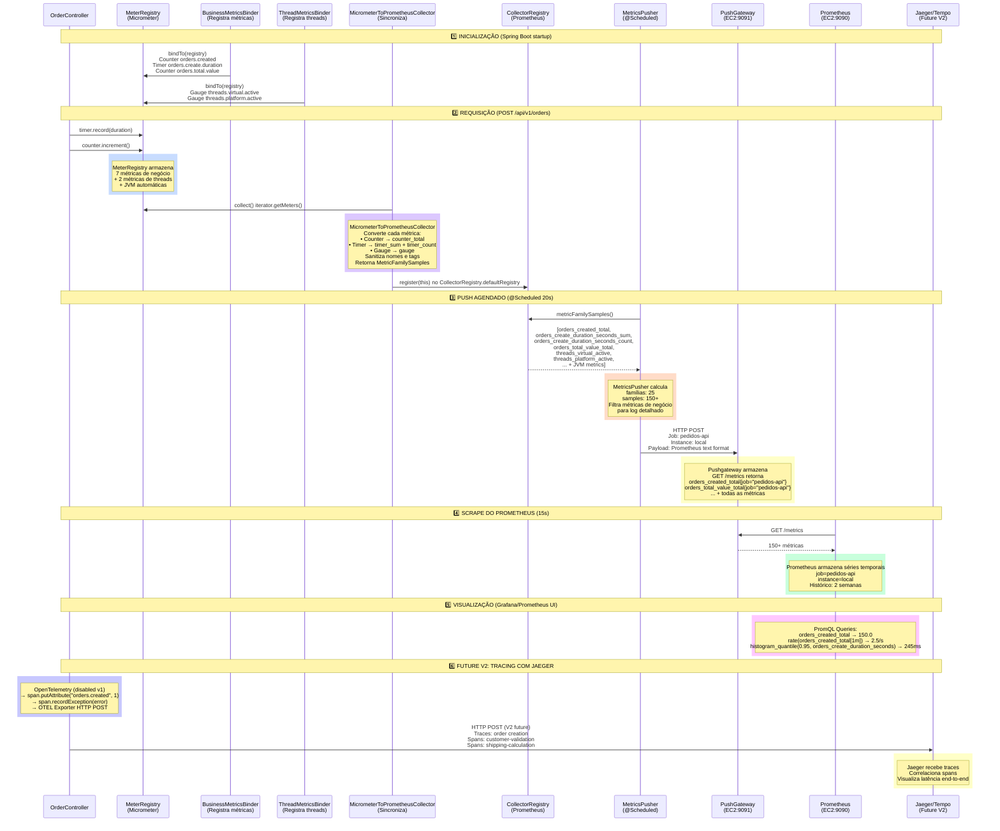
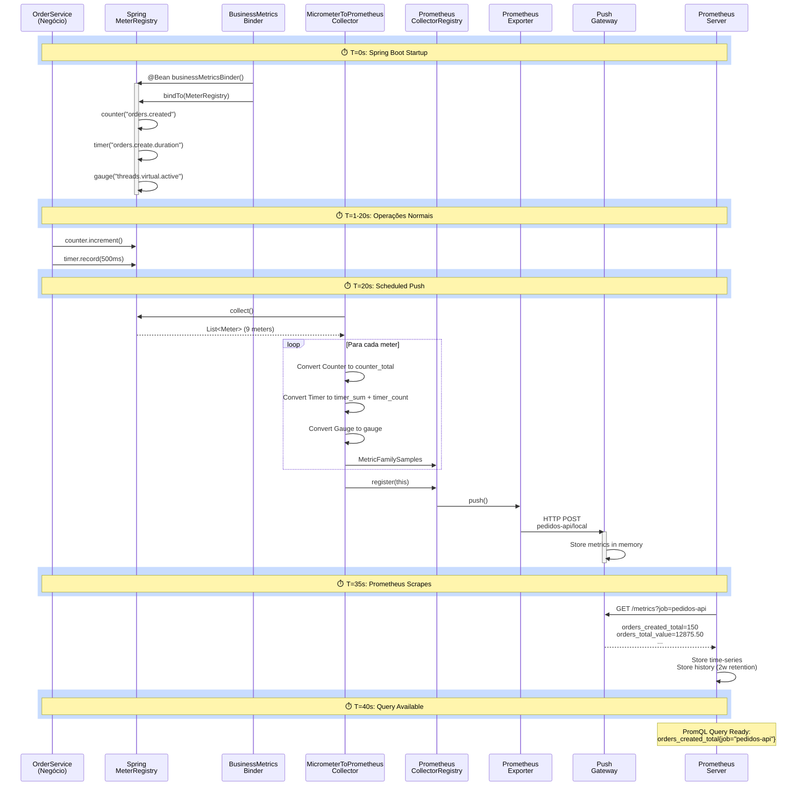
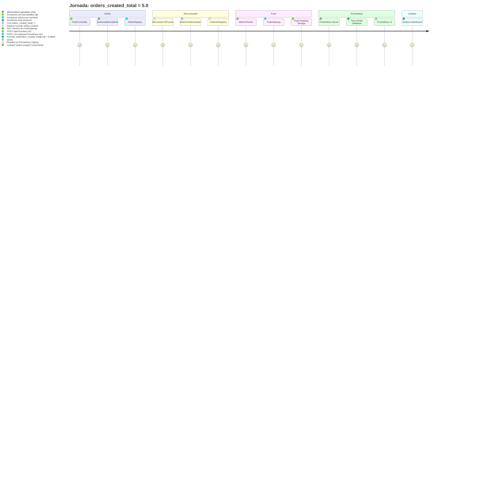

# 🔄 Diagrama de Sequência - Observabilidade

## Fluxo Completo: Pedidos API → Prometheus → Jaeger



---

## 📊 Fluxo Detalhado: MeterRegistry → CollectorRegistry → PushGateway



---

## 🔗 Sincronização Micrometer ↔ Prometheus (Deep Dive)

```mermaid
graph TB
    subgraph Spring["🌱 Spring Boot (MeterRegistry)"]
        BM["📊 BusinessMetricsBinder<br/>@Bean"]
        TM["🧵 ThreadMetricsBinder<br/>@Bean"]
        MR["📈 MeterRegistry<br/>Micrometer"]
        
        BM -->|bindTo| MR
        TM -->|bindTo| MR
    end

    subgraph Sync["🔄 Synchronization Layer"]
        MC["🔗 MicrometerToPrometheusCollector<br/>extends Collector"]
        
        MC -->|register| CR
        MC -->|collect()| MR
    end

    subgraph Prometheus["📊 Prometheus (CollectorRegistry)"]
        CR["📦 CollectorRegistry.defaultRegistry<br/>io.prometheus.client"]
        PoEx["📤 Prometheus Exporter"]
        
        CR -->|publish| PoEx
    end

    subgraph Push["🚀 Push to Gateway"]
        MP["⏱️ MetricsPusher<br/>@Scheduled(20s)"]
        PG["🏠 PushGateway<br/>EC2:9091"]
        
        MP -->|push| PG
        PoEx -->|provide| MP
    end

    subgraph Remote["☁️ Remote (AWS EC2)"]
        Prom["📊 Prometheus Server<br/>:9090"]
        Jaeger["🔍 Jaeger/Tempo<br/>:16686"]
        
        PG -->|GET /metrics| Prom
        Prom -->|OTEL traces| Jaeger
    end

    style BM fill:#e1f5ff
    style TM fill:#e1f5ff
    style MR fill:#b3e5fc
    style MC fill:#fff9c4
    style CR fill:#b3e5fc
    style MP fill:#ffe0b2
    style PG fill:#ffccbc
    style Prom fill:#c8e6c9
    style Jaeger fill:#d1c4e9
```

---

## 📡 Jornada de uma Métrica: `orders_created_total`



---

## 🎯 Matriz de Responsabilidades

```mermaid
graph LR
    A["OrderController<br/>(Usa MeterRegistry)"]
    B["BusinessMetricsBinder<br/>(Registra métricas)"]
    C["MicrometerToPrometheusCollector<br/>(Sincroniza)"]
    D["MetricsPusher<br/>(Faz push)"]
    E["PushGateway<br/>(Armazena)"]
    F["Prometheus<br/>(Scrape)"]
    G["Jaeger<br/>(Traces v2)"]

    A -->|counter.increment()| B
    B -->|bindTo| A
    C -->|collect()| B
    C -->|register| D
    D -->|gateway.push| E
    E -->|GET /metrics| F
    A -.->|OTEL traces v2| G
    
    style A fill:#e3f2fd
    style B fill:#f3e5f5
    style C fill:#fff3e0
    style D fill:#ffe0b2
    style E fill:#ffccbc
    style F fill:#c8e6c9
    style G fill:#d1c4e9
```

---

**Versão:** 1.0  
**Status:** ✅ V1 (PUSH) - V2 (Tracing) em planejamento
