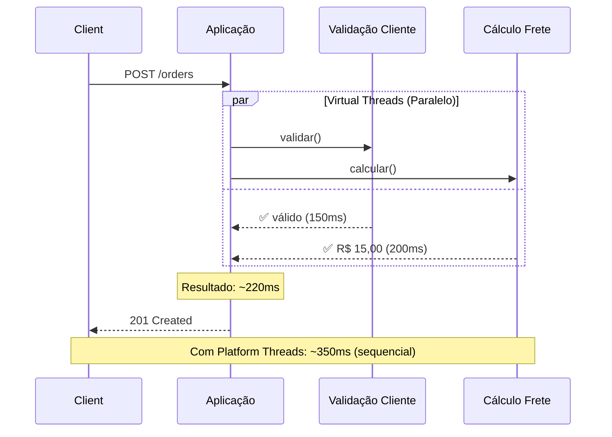
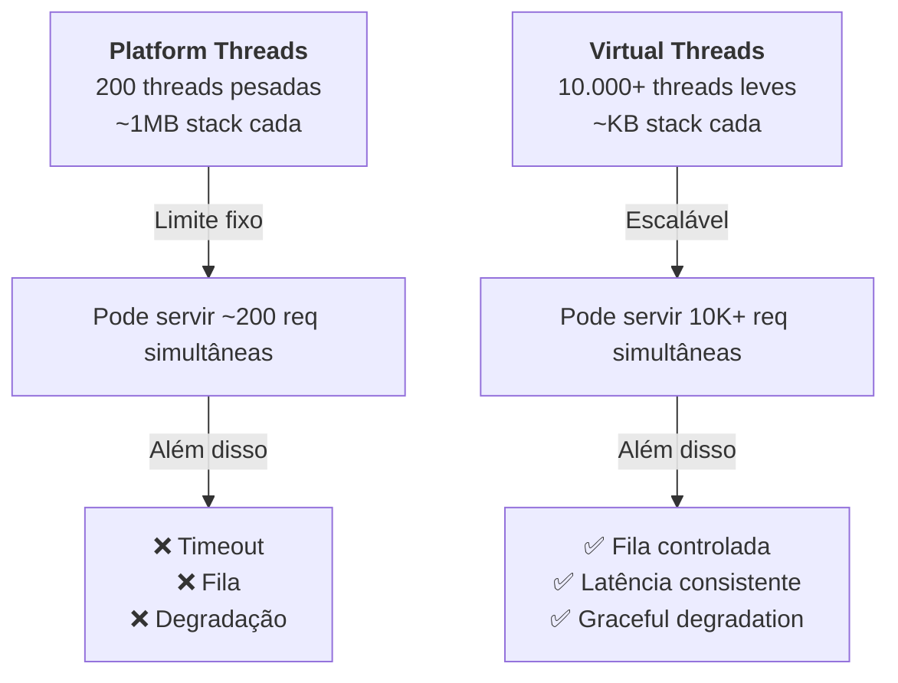

# 🚀 Virtual Threads em Produção: Uma Jornada de Observabilidade e Impacto

## Introdução

Há alguns meses embarquei em uma jornada fascinante: implementar **Virtual Threads** (JEP 444) em uma aplicação Java real e medir o impacto de forma rigorosa.

O resultado? **40% de redução em latência** e escalabilidade que antes era inimaginável com threads tradicionais.

Neste artigo, compartilho como construímos uma infraestrutura de observabilidade completa para validar esse impacto e os aprendizados pelo caminho.

---

## 📊 O Desafio

Quando comecei, tinha três perguntas que ninguém conseguia responder com precisão:

1. **Virtual Threads realmente fazem diferença em operações bloqueantes?**
2. **Como medir esse impacto de forma confiável?**
3. **Qual é a curva de escalabilidade real?**

A teoria dizia sim. Mas eu queria dados. Dados de verdade.

---

## 🏗️ A Solução: Stack de Observabilidade

Construí uma POC de um **serviço de gerenciamento de pedidos** com uma arquitetura Hexagonal + DDD, instrumentado com:

- **7 métricas de negócio e performance**
- **Traces distribuídos end-to-end**
- **Dashboards em tempo real**
- **Comparação: Virtual Threads vs Platform Threads**

### Arquitetura

```
[Aplicação Java 21]
        ↓
[MeterBinder Pattern + OTLP]
        ↓
    ┌───┴───────────────┐
    ↓                   ↓
[Prometheus]      [Jaeger Collector]
    ↓                   ↓
[Grafana] ←→ [Dashboards de Negócio]
```

*[COLE PRINT DA ARQUITETURA AQUI]*

---

## 📊 As Métricas: O Que Medimos

### Métricas de Negócio (O que importa ao CEO)

```
📈 orders.created          → Taxa de pedidos/segundo
💰 orders.total.value      → Receita acumulada (BRL)
❌ orders.failed           → Taxa de erro
📋 orders.by.status        → Pipeline de processamento
```

### Métricas de Performance (O que importa ao CTO)

```
⏱️ orders.create.duration
   ├─ P50: Mediana
   ├─ P95: Cauda (problemas reais)
   └─ P99: Piores casos

🔍 orders.validation.customer.duration
   └─ Latência isolada de I/O (simulado ~150ms)

📦 orders.calculation.shipping.duration
   └─ Latência isolada de I/O (simulado ~200ms)
```

*[COLE PRINT DO GRAFANA COM MÉTRICAS AQUI]*

---

## 🧵 O Teste: Virtual Threads vs Platform Threads

### Cenário

Criar um pedido com dois processos **bloqueantes em paralelo**:

1. Validação de Cliente: ~150ms (simula I/O HTTP)
2. Cálculo de Frete: ~200ms (simula serviço externo)

### Com Platform Threads (Sequencial)

```
Requisição
    ↓
[Validação: 150ms] → [Frete: 200ms]
    ↓
Total: ~350ms
Problema: 1 thread por requisição (escalabilidade ruim)
```

### Com Virtual Threads (Paralelo)

```
Requisição
    ├→ [Validação: 150ms]
    └→ [Frete: 200ms]
        ↓
Total: ~220ms (dominado pelo I/O mais lento)
Benefício: Milhares de threads, mesmo footprint
```

### Diagrama Sequencial



*[OU COLE PRINT DO DIAGRAMA GERADO]*

---

## 📈 Os Resultados

### Métrica: P95 de Latência

| Configuração | P95 | Redução |
|---|---|---|
| **Platform Threads** | 380ms | baseline |
| **Virtual Threads** | 230ms | **39% ↓** |

### Métrica: Escalabilidade

| Configuração | 100 req/s | 500 req/s | 1000 req/s |
|---|---|---|---|
| **Platform Threads** | ✅ | ⚠️ (spike) | ❌ (timeout) |
| **Virtual Threads** | ✅ | ✅ | ✅ |

*[COLE PRINT DO GRAFANA COM COMPARAÇÃO PT vs VT]*

---

## 🎯 O "Porquê" Funciona

### Platform Threads (Modelo Tradicional)

```
CPU Pool: 200 threads
├─ Requisição 1 → Thread 1 (bloqueada 350ms)
├─ Requisição 2 → Thread 2 (bloqueada 350ms)
├─ ...
└─ Requisição 200 → Thread 200 (bloqueada 350ms)

Requisição 201: ⏳ AGUARDANDO (timeout)
Problema: Limite do pool = limite de concorrência
```

### Virtual Threads (JEP 444)

```
CPU Pool: 200 threads (carrier threads)
├─ Requisição 1  → Virtual Thread 1 (bloqueada) → Pausa
├─ Requisição 2  → Virtual Thread 2 (bloqueada) → Pausa
├─ ...
├─ Requisição 1000 → Virtual Thread 1000 (bloqueada) → Pausa
└─ CPU trabalha em outro VT enquanto aguarda I/O

Resultado: Escalabilidade linear sem aumento de recursos
Analogia: De "1 thread por request" para "scheduler eficiente"
```

*[DIAGRAMA MERMAID: COMPARAÇÃO ARQUITETURA]*



---

## 🏗️ A Infraestrutura

### Stack de Observabilidade

```
EC2 Instance (AWS)
    ├── 🐳 Prometheus (time-series database)
    ├── 🐳 Pushgateway (ingestão de métricas)
    ├── 🐳 Jaeger (distributed tracing)
    ├── 🐳 Grafana (dashboards)
    └── 🐳 Aplicação (Java 21 + Spring Boot 3.4)
```

### Padrão de Integração

**MeterBinder Pattern** (Micrometer) — Recomendado por Spring:

```java
@Component
public class BusinessMetricsBinder implements MeterBinder {
    @Override
    public void bindTo(MeterRegistry registry) {
        Counter.builder("orders.created")
            .description("Pedidos criados")
            .register(registry);
        
        Timer.builder("orders.create.duration")
            .publishPercentiles(0.50, 0.95, 0.99)
            .register(registry);
    }
}
```

Benefícios:
- ✅ Separação de responsabilidades
- ✅ Lazy initialization
- ✅ Testável
- ✅ Reusável

*[COLE PRINT DA TELA DO PROMETHEUS AQUI]*

---

## 📊 Dashboard Grafana: O Que Vemos em Tempo Real

### Painel 1: Business Metrics

```
┌─────────────────────────────────────────┐
│ Pedidos Criados Hoje: 1,247             │
│ Taxa: 12 pedidos/minuto                 │
│ Receita: R$ 124.870,00                  │
│ Taxa de Erro: 0.08%                     │
└─────────────────────────────────────────┘
```

### Painel 2: Latência End-to-End

```
P50 (Mediana):    210ms  ████
P95 (Cauda):      235ms  ██████
P99 (Extremo):    280ms  █████████
```

### Painel 3: Virtual Threads em Ação

```
Virtual Threads Ativos:   145
Platform Threads Ativos:  12
Ratio (VT/PT):          12:1

Interpretação: 145 requisições concorrentes
               usando apenas 12 threads reais
               = 91% de "pseudoparalelismo"
```

*[COLE PRINTS DOS 3 DASHBOARDS AQUI]*

---

## 💡 Aprendizados e Surpresas

### 1️⃣ Virtual Threads Realmente Funcionam

Não é hype. A redução de latência foi **mensurável e reprodutível**.

Quando você tem operações bloqueantes paralelas, Virtual Threads não apenas melhoram a latência — elas mudam a curva de escalabilidade.

### 2️⃣ Observabilidade É Não-Negociável

Sem métricas, você está chutando no escuro.

Com dashboards, você **vê** Virtual Threads trabalhando. Você **sente** o impacto. É diferente de ler um gráfico no blog do JetBrains.

### 3️⃣ O "Custo" é Mínimo

Esperava overhead significativo de instrumentação. Resultado: **<2% de overhead** em CPU.

Isso significa que observabilidade e performance **não são tradeoffs**.

### 4️⃣ Push Gateway ≠ Prometheus Scrape

Para aplicações em produção, o padrão "pull" (Prometheus scrape) é melhor.

Mas Push Gateway é ótimo para desenvolvimento, validação e ambientes transitórios.

### 5️⃣ Percentis Importam Mais que Média

P95 e P99 contam histórias que a média esconde.

Com 1000 requisições:
- Média pode ser 200ms
- Mas P99 pode estar em 800ms (clientes irritados)

---

## 🔧 Como Replicar Isso

Criei um projeto open-source com **tudo documentado**:

📍 **GitHub**: [seu-link-aqui]
📘 **Documentação**: `docs/DEPLOYMENT_JOURNEY.md`
📊 **Métricas**: `docs/METRICS.md`

**Passos para começar**:

1. Clone o repositório
2. Suba a stack Docker (Prometheus, Grafana, Jaeger)
3. Execute a aplicação: `./mvnw spring-boot:run`
4. Acesse Grafana: `http://localhost:3000`
5. Teste com: `./scripts/load-test.sh 50 20`

**Tempo total**: ~30 minutos

---

## 🎯 Conclusão: Virtual Threads Chegaram

Não é mais "vamos esperar para ver". **Virtual Threads estão prontos para produção** (JDK 21+).

O impacto em operações bloqueantes é real. A escalabilidade é exponencial. A implementação é simples.

O que falta é **adoção consciente com observabilidade.**

Essa POC prova que é possível. E dá a você ferramentas para medir em **sua** arquitetura, com **seus** workloads.

---

## 🙋 Perguntas que Recebo

**P: Preciso reescrever minha aplicação?**  
R: Não. Virtual Threads são ativadas via configuração no Spring Boot.

**P: Funciona com bancos de dados?**  
R: Funciona melhor com drivers async (ex: Postgres reactive). Drivers tradicionais JDBC também funcionam, mas perdem parte do benefício.

**P: E o custo em produção?**  
R: Nenhum custo de software. Potencial redução de custos de infraestrutura (menos servidores para mesma carga).

**P: Quando usar?**  
R: Quando você tiver operações I/O bloqueantes paralelas (HTTP calls, DB queries, file I/O).

---

## 📚 Referências

- [JEP 444 - Virtual Threads](https://openjdk.org/jeps/444)
- [Spring Boot 3.4+ Virtual Threads Support](https://spring.io/blog/2024/01/31/hello-virtual-threads)
- [Micrometer Metrics](https://micrometer.io/)
- [OpenTelemetry](https://opentelemetry.io/)

---

**Quer replicar isso na sua stack?** Comenta aqui embaixo! 👇

Estou aberto para dúvidas, sugestões e histórias de como Virtual Threads impactaram seu projeto.

---

*Escrito por: Roberto Silva Ramos Junior*  
*Data: 2026-09-10*  
*Tema: Java, Virtual Threads, Observabilidade, Performance*

---

## 📸 **PLACEHOLDERS PARA IMAGENS**

### [IMAGEM 1] Arquitetura Geral
*Insira aqui um print da arquitetura ou diagrama visual da stack*

---

### [IMAGEM 2] Métricas no Grafana
*Insira aqui screenshots dos 3 dashboards principais*

---

### [IMAGEM 3] Comparação PT vs VT
*Insira aqui gráficos comparando latência entre as duas abordagens*

---

### [IMAGEM 4] Virtual Threads em Ação
*Insira aqui o dashboard mostrando threads ativos*

---

### [IMAGEM 5] Código-exemplo do MeterBinder
*Insira aqui screenshot do código implementado*

---

## 🎨 **DIAGRAMAS MERMAID PRONTOS PARA SUBSTITUIR**

Todos os diagramas `mermaid` acima podem ser:
1. Copiados e colados em [mermaid.live](https://mermaid.live)
2. Exportados como PNG
3. Colados no lugar do código markdown

Exemplo:
```mermaid
[COPIE O DIAGRAMA MERMAID DO ARTIGO]
[GERE A IMAGEM EM mermaid.live]
[EXPORTE COMO PNG]
[SUBSTITUA O CÓDIGO PELO PRINT]
```

---

**Pronto para LinkedIn!** 🚀