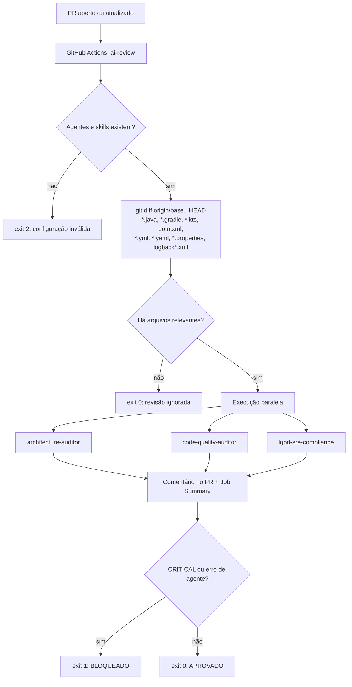

# ADR-001: Pipeline de Governança de IA para revisão de Pull Requests

## Status

Aceito — 2026-09-24

## Contexto

O [CLAUDE.md](../../.claude/CLAUDE.md) define regras **invioláveis** para o projeto:

- **Arquitetura Hexagonal**: `domain` não depende de frameworks nem de `infrastructure`.
- **Qualidade**: SOLID, Clean Code, nunca retornar `null`.
- **LGPD (Lei 13.709/2018)**: nenhum dado pessoal, credencial ou corpo de request/response em logs, traces ou métricas.

Essas regras estavam documentadas como agentes em `.claude/agents/`, mas só eram aplicadas quando alguém rodava a revisão manualmente. Nada impedia um PR que as violasse de chegar ao `main`.

Ferramentas estáticas como ArchUnit, Checkstyle e scanners de segredos cobrem parte do problema. Mas não avaliam contexto semântico: um `toString()` de objeto com CPF gravado em log, dado pessoal usado como tag de métrica, uma injeção de dependência que fere a inversão de dependência.

## Decisão

Adotar um **pipeline de governança no GitHub Actions** que roda, a cada PR, os agentes de `.claude/agents/` contra o diff, usando o **Gemini** (SDK `google-genai`). O PR é **bloqueado** quando algum agente encontra uma violação `CRITICAL`.

### Componentes

| Arquivo | Papel |
|---|---|
| [`.github/workflows/ai-governance.yml`](../../.github/workflows/ai-governance.yml) | Gatilho `pull_request` (`opened`, `synchronize`, `reopened`), permissões mínimas, instalação do Python |
| [`.github/scripts/orchestrator.py`](../../.github/scripts/orchestrator.py) | Coleta o diff, executa os agentes em paralelo, publica o relatório e define o código de saída |
| [`.github/scripts/requirements.txt`](../../.github/scripts/requirements.txt) | Dependência `google-genai` |

### Agentes

| Agente no pipeline | Fontes do prompt | Bloqueia (CRITICAL) quando |
|---|---|---|
| `architecture-auditor` | `architecture-auditor.md` | `domain`/`application` importa `infrastructure`; `domain` importa Spring, JPA ou HTTP |
| `code-quality-auditor` | `code-quality-auditor.md` | Violação de regra inviolável (critério geral) |
| `lgpd-sre-compliance` | `lgpd-auditor.md` + `lgpd-sre-compliance-skill/` | Dado pessoal em log/trace/exceção sem máscara; log de body ou `toString()`; credencial no código ou em configuração; dado pessoal como tag de métrica; dado pessoal real em testes |

### Fluxo

### Regras de execução

- **Fail-closed**: se um agente falhar (API fora do ar, modelo inexistente, cota esgotada), o PR é bloqueado. A esteira nunca aprova sem ter revisado.
- **Novas tentativas só para erros transitórios**: até 3 tentativas com espera crescente, apenas para HTTP 408, 429 e 5xx. Os erros 400, 401, 403 e 404 falham na hora.
- **Modelo configurável**: o padrão é `DEFAULT_MODEL` no script; a variável de repositório `GEMINI_MODEL` tem prioridade. Trocar de modelo não exige mudar código.
- **Um comentário por PR**: o relatório atualiza o mesmo comentário, identificado pelo marcador `<!-- ai-governance-review -->`.
- **A decisão final de merge é humana**: o pipeline só aponta os problemas, conforme o princípio de Agência Humana do CLAUDE.md.

### Controles de segurança (SAIF)

- **Contra prompt injection**: o diff entra entre `<pr_diff>` e `</pr_diff>` e é tratado explicitamente como dado não confiável.
- **Contra exfiltração no comentário**: a resposta do modelo é limpa antes de publicar; imagens e links são removidos, HTML e `|` são escapados.
- **Minimização (LGPD Art. 6º III)**: o log registra só metadados (arquivo, linha, regra, severidade), nunca o diff nem a resposta bruta do modelo.
- **Menor privilégio**: `permissions: contents: read, pull-requests: write`. O gatilho é `pull_request`, e não `pull_request_target`, para não expor segredos a código vindo de forks.

### Obrigatoriedade

O bloqueio de merge depende de um **Ruleset** no `main` com o status check `ai-review` obrigatório e a lista de bypass vazia. Sem essa configuração, o check falha mas o merge continua liberado.

## Validação

A decisão foi validada com um PR que trazia a classe de teste `domain/model/PedidoRepositorioAcoplado.java`, com violações intencionais:

| Violação | Agente |
|---|---|
| `domain` importando `OrderController` (infrastructure) e anotações Spring | architecture-auditor |
| CPF, email e telefone concatenados em `logger.info` | lgpd-sre-compliance |
| Chave de API fixa no código e gravada em log | lgpd-sre-compliance |
| Injeção por campo, `return null`, retorno `Object` | code-quality-auditor |

A esteira **bloqueou** o PR, como esperado. Em seguida a classe foi **removida** para liberar a esteira.

A validação também revelou dois problemas, já corrigidos:

1. **Modelo descontinuado**: o workflow fixava `gemini-2.5-pro` como valor reserva de `GEMINI_MODEL`, e a API respondeu `404 NOT_FOUND`. O valor reserva foi removido do workflow; o modelo padrão agora fica só no script.
2. **Novas tentativas inúteis**: o 404 era repetido 3 vezes. Agora erros permanentes falham na hora.

## Alternativas consideradas

| Alternativa | Motivo da rejeição |
|---|---|
| Só ferramentas estáticas (ArchUnit, Checkstyle, gitleaks) | Determinísticas e baratas, mas não avaliam contexto semântico. **São complementares**, não substituem o pipeline |
| Gatilho `pull_request_target` | Daria acesso a segredos a código não confiável vindo de forks |
| Um único agente com todas as regras | Prompt grande e difuso; misturar responsabilidades reduz a precisão. Agentes separados também permitem critérios de bloqueio por domínio |
| Fail-open (aprovar se a IA falhar) | Uma indisponibilidade da API viraria uma forma de contornar a governança |
| Claude ou OpenAI como provedor | Tecnicamente equivalentes; o Gemini foi a escolha do time. A troca fica isolada na função `call_gemini` |

## Consequências

### Positivas

- As regras invioláveis do CLAUDE.md passam a ser **verificadas de forma automática e auditável** em todo PR.
- Os agentes de `.claude/agents/` servem de **fonte única**: são os mesmos prompts usados na revisão local e na CI.
- Achados de LGPD são barrados **antes** de chegar a produção (prevenção, Art. 46).
- Relatório padronizado no PR e no Job Summary, com logs por agente para diagnóstico.

### Negativas e trade-offs

- **Não determinismo**: o mesmo diff pode receber classificações diferentes, por exemplo `MAJOR` em vez de `CRITICAL`. Falsos negativos e falsos positivos são possíveis; a revisão humana continua necessária.
- **Código enviado a terceiros**: o diff é processado pela API do Google. Não deve haver dados pessoais reais nem segredos no código; a própria regra LGPD já trata isso como CRITICAL.
- **Dependência externa**: uma indisponibilidade, cota esgotada ou modelo descontinuado **bloqueia todos os PRs** (efeito colateral do fail-closed).
- **Custo e latência**: cada push em PR gera 3 chamadas ao modelo.
- **PRs de forks** não recebem secrets e falham.
- **Limites**: diff truncado em 200.000 caracteres; comentário do GitHub limitado a cerca de 65.000 caracteres.

## Pendências

- Avaliar a inclusão do agente SAIF (`saif-agent.md` + `saif-skill`) e de um agente baseado em `global-ai-principles`.
- Adicionar ferramentas determinísticas complementares: testes ArchUnit (a dependência já está no `pom.xml`, mas ainda não há regras) e um scanner de segredos no workflow.
- Definir uma estratégia para PRs de forks, caso o repositório passe a aceitar contribuições externas.
